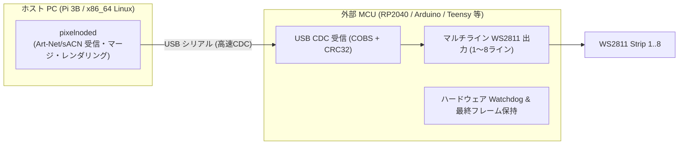
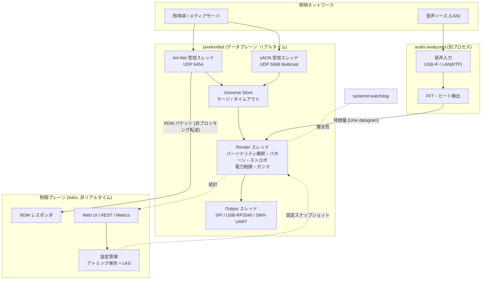
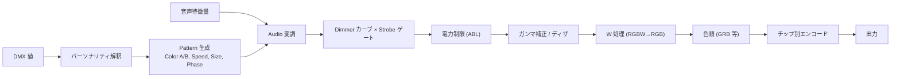
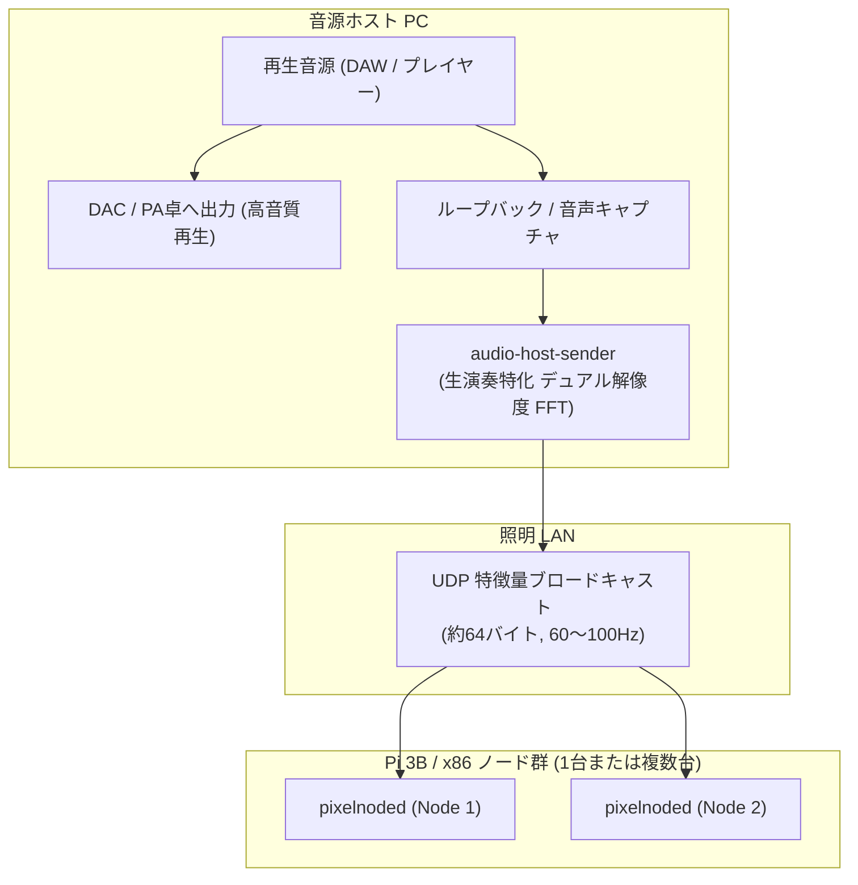

# Pixel LED ノード 設計書（仮称: `pixelnode`）

Art-Net 4 (RDM含む) / sACN (E1.31) で DMX を受信し、Pixel LED (WS2811 / WS2812B 等) を駆動する Rust 製ノード。
対象: Raspberry Pi 3B (aarch64) を主ターゲット、x86_64 Linux を副ターゲットとする。

> [!IMPORTANT]
> 設計方針の最上位は **「ショー中に絶対に止まらない・止まっても見えない」**。
> 機能・性能・作りやすさは、すべてこの方針に従属させる。

---

## 1. 設計原則（Reliability First）

| # | 原則 | 具体策 |
|---|------|--------|
| P1 | **データプレーンと制御プレーンの分離** | DMX受信→レンダリング→出力の経路(データプレーン)は Web UI・RDM・音声解析が死んでも止まらない |
| P2 | **ホットパスで失敗しない** | 起動後は動的メモリ確保なし・ブロッキングI/Oなし・`unwrap`/`panic`/インデックス直アクセス禁止 (clippy で強制) |
| P3 | **壊れたら即・静かに復帰** | panic=abort → systemd が <1秒で再起動。WS281x は最後のデータを保持するので見た目上は止まらない。直前フレームは `/dev/shm` に保持し復帰時に再送 |
| P4 | **入力を信用しない** | 全パケットパーサは境界チェック付き自前実装、fuzz テスト必須 |
| P5 | **異常時の挙動を明示的に定義** | 信号断・ソース競合・電源不足など全ケースに「どう光るか」を設定で決める (§8) |
| P6 | **ストレージに書かない** | ルートFSは読み取り専用、ログはRAM、設定はアトミック書き込み + Last-Known-Good |
| P7 | **ショー中は変更させない** | 「Show Lock」モードで RDM SET / Web からの設定変更をロック |

---

## 2. ハードウェア構成

### 2.1 WS2811 (24V 576LEDs/m) と Pi の出力構成

今回採用する主たるストリップは **WS2811 24V (576 LEDs/m)** です。

#### 24V WS2811 の特徴と注意点
- **電圧降下に極めて強い**: 5Vストリップ（WS2812B）に比べ電圧降下による末端の赤変・減光が起きにくく、電源注入（Power Injection）の間隔を長く取れる（数m単位）。
- **セグメント構造の理解**: 24V WS2811 の高密度ストリップ（COBタイプ等）は通常、内部でLED複数個（例: 18〜36LEDs）が直列接続され、**1個のWS2811 ICで1セグメント（1アドレスピクセル）**を駆動します。そのため、576 LEDs/m の場合でも制御ピクセル数は例えば 1mあたり 16〜32 ピクセル程度（製品仕様による）になることが一般的です（もしICが個別配置された特殊品の場合は1mで576ch〜1728chとなり大量のユニバースが必要となります）。
- **色順（Color Order）**: WS2811 はチップ・メーカー・ロットにより内部配線が異なり、**`RGB` / `BRG` / `GRB`** などが混在します（WS2812Bは主にGRB）。設定ファイル（TOML）でピクセルストリップごとに任意の色順を完全指定可能にします。
- **信号レベル変換**: WS2811 の信号入力は 5V ロジック（VIH ≥ 0.7*VDD または 3.5V程度）です。Pi の GPIO（3.3V）直結では誤動作・ノイズ耐性低下の元になるため、**74AHCT125 等の高速CMOSバッファによる 3.3V → 5V レベルシフタを必須**とし、出力直後に 33〜100Ω のダンピング抵抗を入れます。

#### Pi 3B 単体での直接駆動方式の検討
WS2811 の通信は 800kbps（1bit=1.25µs、許容誤差 ±150ns）。Linux ユーザー空間での GPIO ビットバンギングは不可。

| 方式 | ピン | 安定性 | 備考 |
|------|------|--------|------|
| **SPI0 + DMA (推奨)** | GPIO10 (MOSI, 物理19番) | ◎ | 標準 `spidev` ドライバで動作。root不要。オンボードオーディオやI2Sと競合しない。**Pi 5 でもそのまま動作可能** |
| PWM + DMA (rpi_ws281x) | GPIO18 / GPIO13 | ○ | `/dev/mem` 直叩き・root必須。3.5mm アナログ音声と競合。Pi 5 非対応 |
| PCM + DMA | GPIO21 | ○ | I2S オーディオHATと競合 |
| GPIO ビットバンギング | 任意 | ✕ | 採用しない（Linuxのスケジューラジッタで確実に点滅・化けが発生） |

**→ Pi 単体直結は SPI0 方式（1ライン）を採用。** 

#### SPI での WS2811 信号生成
SPI クロック 3.2MHz（1bit = 312.5ns）を使用し、WS2811 の 1bit を SPI の 4bit で表現：
- `0` bit: `1000` (High 312.5ns / Low 937.5ns)
- `1` bit: `1100` (High 625.0ns / Low 625.0ns) または `1110` (High 937.5ns / Low 312.5ns)
- リセット（ラッチ）期間: **≥ 300µs**（WS2811のロット差を考慮し、余裕を持たせたゼロ埋め）。

> [!WARNING]
> **Pi 3B 固有の重要設定**:
> Pi 3B の SPI クロックは VPU コアクロックから分周されるため、CPU負荷変動に伴う周波数スケーリングでクロックがブレると**信号タイミングが崩れてLEDがチラつきます**。
> `/boot/firmware/config.txt` に必ず `core_freq=250`（または `force_turbo=1`）を設定してコアクロックを固定してください。
> また `cmdline.txt` に `spidev.bufsiz=65536` を追加して SPI DMA 転送バッファを拡張します。

### 2.2 複数ライン・多台数・x86 展開（USB-MCU コプロセッサ方式）

ストリップが複数ラインに及ぶ場合、あるいは Linux PC (x86_64) をホストとして Arduino / RP2040 を複数台USB接続して大規模ピクセル展開を行う構成に対応します。



- 出力ドライバ層を `trait PixelSink` として抽象化。
  - `SpiSink` (Pi 内蔵 SPI)
  - `SerialMcuSink` (USB シリアル / RP2040 / Arduino)
  - `DmxUartSink` (RS-485 DMX512)
  - `SimSink` (開発用仮想出力 / コンソール / ネットワーク)
- ホスト側 `pixelnoded` は同一バイナリのまま、設定ファイル（TOML）の `driver = "spi"` / `driver = "usb_serial"` を切り替えるだけで自在にスケールアウト可能。

### 2.3 物理 DMX512 入出力（オプション）
- UART (PL011) + RS-485 絶縁型トランシーバ（ADM2587E 等）で 250kbps 8N2。
- Pi 3B では `dtoverlay=disable-bt` で PL011 を解放して使用。
- x86 では Enttec DMX USB Pro 互換デバイスまたは FTDI USB-RS485 を使用。

### 2.4 電源とノイズ対策（ライブ現場での安定性）
- **24V 電源と 5V 電源（Pi）の分離**: Pi への電源は高品質な別電源（5V/2.5A以上）から供給。GND は必ず共通接続。
- **サージ保護とヒューズ**: 24V LED電源ラインには適切な容量の速断ヒューズ（またはブレーカー）を設置。
- **長距離信号伝送**: Pi / MCU とストリップの先頭が 2〜3m 以上離れる場合は、信号線を RS-485 差動ドライバ（SN65HVD 等）でツイストペア伝送し、ストリップ直前でレシーバ受けてシングルエンドに戻す構成を推奨。

---

## 3. システム全体構成



### 3.1 スレッドモデル（データプレーン）

データプレーンは **async を使わず固定スレッド** で構成（挙動が予測可能、優先度を個別に制御できる）。

| スレッド | 優先度 | 役割 | 通信 |
|---------|--------|------|------|
| `rx-artnet` | SCHED_FIFO 50 | 受信・パース・不要ユニバースは即破棄 | Universe Store に書き込み |
| `rx-sacn` | SCHED_FIFO 50 | 同上 | 同上 |
| `render` | SCHED_FIFO 60 | 固定周期 or 同期パケット駆動でフレーム生成 | Store から最新スナップショット取得 → 出力へ triple buffer |
| `out-N` | SCHED_FIFO 70 | 出力デバイスへの書き込み（ブロッキング可） | triple buffer から最新フレーム取得 |
| `supervisor` | 通常 | 各スレッドのハートビート監視、sd_notify | アトミックカウンタ |

- スレッド間は **ロックフリー（triple buffer / seqlock / アトミック）** のみ。Mutex を待つことはない。
- 制御プレーンへの転送は **容量固定チャネルに `try_send`**。満杯なら捨てる（データプレーンは決してブロックしない）。
- `mlockall()` でページアウト防止。Pi 3B の 4 コアのうち 1 コアを `isolcpus` で出力系専用にするオプション。

### 3.2 レンダリング周期の考え方

| モード | 駆動方式 | 理由 |
|--------|---------|------|
| プリセット（パターン）モード | 内部固定周期（既定 50Hz） | パターンの時間進行を一定にするため |
| ピクセル直接制御モード | **受信駆動**（ArtSync / sACN Sync / 全ユニバース揃った時点）+ 上限レート | 送信側 fps と内部周期のズレによるカクつき(ジャダー)を防ぐ |

レイテンシ目標: パケット受信 → LED 反映 **< 40ms**（300px で SPI 転送約 9ms）。

---

## 4. ソフトウェア構成（Cargo workspace）

```
rasPi_Art-Net_Lighting-Ctrl/
├─ Cargo.toml                 # workspace
├─ crates/
│  ├─ proto-artnet/           # Art-Net 4 パーサ/シリアライザ (no_std, ゼロアロケーション)
│  ├─ proto-sacn/             # E1.31 (Data / Sync / Universe Discovery)
│  ├─ proto-rdm/              # E1.20 RDM PDU、レスポンダロジック
│  ├─ dmx-universe/           # ユニバース保持・ソース管理・マージ・タイムアウト
│  ├─ fixture/                # パーソナリティ定義 (§6) とチャンネル解釈
│  ├─ engine/                 # パターン・ストロボ・音声変調・電力制限・ガンマ
│  ├─ output/                 # trait PixelSink + spi_ws281x / rp2040_usb / dmx_uart / sim
│  ├─ audio-proto/            # 音声特徴量メッセージ定義
│  └─ control/                # Web/REST (axum), 設定, Prometheus メトリクス
├─ bins/
│  ├─ pixelnoded/             # メインデーモン
│  ├─ audio-analyzerd/        # 音声解析デーモン (別プロセス)
│  └─ pxtool/                 # CLI: テスト送信機、テストパターン、診断
├─ firmware/rp2040-output/    # embassy-rp (別ワークスペース, Phase 5)
├─ fuzz/                      # cargo-fuzz ターゲット
├─ deploy/                    # systemd unit, config.txt 断片, cargo-deb 設定
└─ docs/
```

### 4.1 主要な技術選定

| 用途 | 採用 | 理由 |
|------|------|------|
| Art-Net / sACN / RDM | **自前実装** | プロトコル自体は単純。ゼロアロケーション・fuzz 済みであることを自分で保証したい。既存 crate はメンテ状況・アロケーション方針が不確実 |
| ソケット | `socket2` | `SO_RCVBUF` 拡大、マルチキャスト参加、`SO_REUSEADDR` |
| SPI | `spidev` | カーネル標準ドライバ経由（root 不要、`spi` グループで可） |
| スレッド優先度 | `thread-priority` / `libc` | SCHED_FIFO, CPU affinity |
| スレッド間共有 | `triple_buffer`, `arc-swap` | ロックフリー |
| systemd 連携 | `sd-notify` | READY / WATCHDOG |
| 制御プレーン | `tokio` + `axum` | データプレーンとは別ランタイム |
| 設定 | `serde` + `toml` | 人が読める、差分管理しやすい |
| ログ | `tracing` → journald (volatile) | SD に書かない |
| 音声 | `cpal`(ALSA), `realfft` | |
| MCU 通信 | `postcard` + COBS + CRC32 | フレーミングと破損検出 |
| ターゲット | `aarch64-unknown-linux-gnu`, `x86_64-unknown-linux-gnu` | Pi 3B も 64bit OS Lite で統一。`cross` または `cargo-zigbuild` でクロスビルド |

### 4.2 コーディング規約（安定性のための強制ルール）

```rust
// データプレーン crate の lib.rs 先頭
#![forbid(unsafe_code)]            // unsafe が必要な箇所は専用の小 crate に隔離
#![deny(clippy::unwrap_used, clippy::expect_used, clippy::panic,
        clippy::indexing_slicing, clippy::arithmetic_side_effects)]
```

- 算術は `saturating_*` / `wrapping_*` を明示。
- 起動後のヒープ確保ゼロをテストで検証（`assert_no_alloc` 等のカウンタ付きアロケータ）。
- 時刻は全て `CLOCK_MONOTONIC`（NTP による時刻ジャンプの影響を受けない）。
- `Cargo.toml`: `[profile.release] panic = "abort"`, `lto = true`, `codegen-units = 1`。

---

## 5. ネットワークプロトコル

### 5.1 Art-Net 4

| OpCode | 対応 | 備考 |
|--------|------|------|
| ArtPoll / ArtPollReply | ✅ 必須 | 卓からのノード検出。ポート数に応じて複数 Reply（Bind Index） |
| ArtDmx | ✅ 必須 | 15bit Port-Address (Net:SubNet:Universe) |
| ArtSync | ✅ | 複数ユニバースの同時反映（ティアリング防止） |
| ArtAddress | ✅ | 卓からのノード名・ユニバース変更（Show Lock 中は拒否） |
| ArtTodRequest / ArtTodData / ArtTodControl | ✅ | RDM デバイス一覧 |
| ArtRdm | ✅ | RDM GET/SET |
| ArtIpProg | △ | 既定無効（ショー中の IP 変更事故防止） |
| ArtTimeCode | △ | 将来のパターン同期用 |

- マージ: 同一ユニバースへの 2 ソースまで HTP/LTP（Art-Net 仕様準拠）、3 ソース目以降は破棄。

### 5.2 sACN (E1.31-2018)

- マルチキャスト `239.255.{hi}.{lo}` に**必要なユニバースだけ参加**（IGMP スヌーピング対応スイッチ推奨）。
- **優先度マージ**: 最高優先度のソースを採用、同優先度は HTP。
- ソースタイムアウト 2.5 秒、Stream Terminated ビット即時処理。
- Synchronization Universe 対応、Universe Discovery 送信（任意）。
- 将来: ETC 拡張の per-address priority (Start Code 0xDD)。

### 5.3 プロトコル共存ルール

- **Art-Net と sACN を同一ユニバースで混ぜない**（チラつきの原因）。ユニバースごとに `artnet` / `sacn` / `auto` を設定。`auto` の場合は sACN 優先、sACN が途絶したら Art-Net へ。
- ユニバース番号の対応（**よくある事故**）: Art-Net は 0 始まり、sACN は 1 始まり。卓によって「Art-Net 0 = sACN 1」扱い。設定で明示的にマッピングする。

### 5.4 受信の堅牢化

- `SO_RCVBUF` を 4MB 程度に拡大（`net.core.rmem_max` も調整）。
- ヘッダの ID / 長さ / OpCode を検証し、**購読していないユニバースはペイロードを読まずに破棄**。
- Pi 3B の Ethernet は 100Mbps かつ **USB2.0 バスを共有**。大規模卓の Art-Net ブロードキャスト（数百ユニバース）を受けると無駄に CPU を食うため、**sACN マルチキャストか Art-Net ユニキャスト運用を推奨**。照明専用ネットワーク / VLAN を分ける。

---


## 6. DMX チャンネル設計 & パーソナリティ

### 6.1 設計方針（DMX アドレス消費対策と柔軟性の両立）

ライブ現場では、ムービングライトやLEDパーなど多数の灯体とDMXユニバース（512ch）を取り合います。そのため、**「アドレス消費を最小限（わずか7ch）に抑えて手軽に運用するプリセットモード」**を基本とし、メディアサーバー連携や細密な演出を行いたいシーンでは**「個別ピクセル制御モード（マルチユニバース跨ぎ）」**へ切り替えられるアーキテクチャとします。

### 6.2 パーソナリティ一覧（RDM `DMX_PERSONALITY` または設定で切替可能）

| No | パーソナリティ名 | ch数 | 用途・特徴 |
|:--:|------------------|:----:|------------|
| **1** | **Preset 7ch（既定・推奨）** | **7** | **【DMX省アドレス運用】** 1ストリップわずか7ch。マスター調光/ストロボ、RGBWベース色、点灯パターン、音声自動同期を凝縮。 |
| **2** | **Standard 12ch** | **12** | **【パラメータ拡張】** パターンの流れる速度（Speed）や模様の幅（Size）、音声ゲインを卓フェーダーでリアルタイムに微調整したい現場向け。 |
| **3** | **Pixel Direct RGB** | **3 × px** | **【個別ピクセル制御】** 1ピクセルあたりRGB(3ch)。170px/ユニバースで次ユニバースへ自動展開。メディアサーバーやピクセルマッピング用。 |
| **4** | **Pixel Direct RGB + Master** | **2 + 3 × px** | 個別ピクセル制御の先頭に全体マスターDimmerとStrobe(2ch)を付加したモード。 |
| **5** | **Segment N** | **2 + 4 × N** | ストリップを N 分割し、区画ごとに RGBW を制御（Dimmer/Strobe 共通）。 |

---

### 6.3 Preset 7ch（基本・省アドレスモード）チャンネルマップ

| ch | 機能 | DMX値の範囲 | 動作仕様 | 既定値 |
|:---:|---|:---:|---|:---:|
| **1** | **Dimmer / Strobe** | 0–7<br>8–134<br>135–239<br>240–255 | **消灯 (Blackout)**<br>**マスターディマー (0% → 100%)**<br>**ストロボ (低速 1Hz → 高速 25Hz)**<br>**全開 (Full Open 100%)** | 0 |
| **2** | **Red** | 0–255 | ベース色 赤 | 0 |
| **3** | **Green** | 0–255 | ベース色 緑 | 0 |
| **4** | **Blue** | 0–255 | ベース色 青 | 0 |
| **5** | **White** | 0–255 | ベース色 白（WS2811時はRGB合成または無視を選択可） | 0 |
| **6** | **点灯 Pattern** | 0<br>1–255 | **Static（ベース色での単純点灯）**<br>**専用点灯パターン（チェイス、ウェーブ、グラデーション等）** | 0 |
| **7** | **音声同期** | 0<br>1–255 | **Off（ch 6 の点灯パターンに従う）**<br>**専用の音声自動制御パターン（音量パルス、キック連動、スペクトラム等）** | 0 |

#### 点灯 Pattern (ch 6) と 音声同期 (ch 7) の優先度ルール
- **ch 7 (音声同期) = 0 のとき**:
  - 音声同期は無効。**ch 6 (点灯 Pattern)** で指定されたパターンが通常通り動作。
- **ch 7 (音声同期) ≥ 1 のとき（音声演出優先）**:
  - **ch 7 で指定された専用の「音声自動制御パターン」が最優先で動作**（ch 6 のパターンをオーバーライド）。
  - ch 2〜5 のベース色と ch 1 のマスター調光/ストロボは、音声自動演出に対してもそのまま適用されます。
  - **オペレーション利点**: 卓オペレーターは通常 ch 7 を 0 にしておき、サビやソロなど音に連動させたい瞬間だけ ch 7 を上げるだけで、即座に音同期演出へ切り替わります。

---

### 6.4 個別ピクセル制御モード（Pixel Direct RGB モード & マルチユニバース跨ぎ）

1ピクセル単位で映像データやマッピング信号を直接流し込むモードです。

- **消費チャンネル数**: `制御ピクセル数 × 3 ch`（R, G, B）
  - 例: 300 ピクセル ＝ 900 チャンネル消費
- **マルチユニバース自動跨ぎ（Multi-Universe Span）仕様**:
  - 1ユニバース（512ch）には最大 170 ピクセル（510ch）が収まります（末尾 2ch 余り）。
  - **業界標準境界（170px/Univ、既定）**:
    - **Universe 1**: Pixel 1 〜 170（DMX ch 1 〜 510 を使用、ch 511-512はパディングとしてスキップ）
    - **Universe 2**: Pixel 171 〜 300（DMX ch 1 〜 390 を使用）
    - ChamSys MagicQ、MADRIX、Resolume、QLC+ 等の標準ピクセルマッピングプロファイルと完全一致。
  - **Packed 境界（設定で切替可）**:
    - ch 511-512 の隙間を作らず、Pixel 171 の R,G を Univ 1 の末尾に、B を Univ 2 の ch 1 に配置するモード。
- **フレーム同期**: ArtSync または sACN Synchronization Universe に対応し、複数ユニバースにまたがるピクセル描画での画面の分断（ティアリング）を完全に防止。

---

### 6.5 Standard 12ch（パラメータ拡張モード）

パターンの速度やサイズをリアルタイムに操作したい現場向け。

| ch | 機能 | 値 | 既定値 |
|:---:|---|---|:---:|
| 1 | Dimmer | 0–255 リニア（内部調光カーブ適用） | 0 |
| 2 | Shutter / Strobe | 0–9 Open / 10–239 Strobe 遅→速 / 240–255 Open | 0 |
| 3 | Red | 0–255 | 0 |
| 4 | Green | 0–255 | 0 |
| 5 | Blue | 0–255 | 0 |
| 6 | White | 0–255 | 0 |
| 7 | Pattern | 0–3 Static / 4–7 Pattern 1 / … （4値幅スロット） | 0 |
| 8 | Pattern Speed | 0–7 既定速度 / 8–127 正方向 遅→速 / 128–135 停止 / 136–255 逆方向 遅→速 | 0 |
| 9 | Pattern Size | 0 既定 / 1–255 パターン固有パラメータ（幅・密度等） | 0 |
| 10 | Audio Mode | 0–7 Off / 8–15 Mode 1 / …（8値幅スロット） | 0 |
| 11 | Audio Gain | 0 AGC（自動）/ 1–255 手動ゲイン | 0 |
| 12 | Control | 0–9 なし / リセット等（3秒保持で実行） | 0 |

---

### 6.6 卓との連携（MagicQ, QLC+, Daslight 等）

主要な3大ソフトウェアおよび標準規格のプロファイルをプロジェクト内に標準同梱・自動生成します。

- **ChamSys MagicQ**: `.hed` フィクスチャファイル（Preset 7ch, Standard 12ch, Pixel Direct を定義）。
- **QLC+**: `.qxf` 定義ファイル（クリックピッカー、各スロット名完全バインド）。
- **Daslight (Nicolaudie)**: `.ssl2` プロファイル（DVC / Daslight 4/5 対応）。
- **GDTF (General Device Type Format)**: `.gdtf` 標準フォーマット（grandMA3 等の近代卓共通）。

#### WS2811 (RGB) における White (ch 5) の挙動
WS2811 は物理的に RGB の 3 色です。White チャンネルの動作はフィクスチャ設定で選択可能：
1. **RGB 合成（既定）**: White の値を R, G, B すべてに加算（最大値クランプ、または指定色温度 3200K / 5600K でRGB展開）。照明さんが「Whiteフェーダーを上げたのに光らない」という混乱を防止。
2. **無視（Ignore）**: 純粋に RGB のみで制御（W フェーダーは無視）。
3. **SK6812 等のネイティブ RGBW**: そのまま White LED を独立点灯。

---

## 7. レンダリングエンジン

### 7.1 パイプライン（仮想フィクスチャごと）



### 7.2 パターン

```rust
pub trait Pattern: Send {
    /// 純粋関数的に描画する。時刻は注入されるのでテストで決定論的に再現可能。
    /// ヒープ確保禁止。out の長さはフィクスチャのピクセル数。
    fn render(&mut self, ctx: &PatternCtx, out: &mut [Rgbw]);
}

pub struct PatternCtx {
    pub phase: Phase,          // Speed と経過時間から算出
    pub size: u8,
    pub color_a: Rgbw,
    pub color_b: Rgbw,
    pub audio: AudioFeatures,  // 未接続時はニュートラル値
}
```

- パターンは静的テーブルで登録（実行時の動的ロード無し）。
- **複数ノード間のパターン位相同期**: 位相を chrony で同期した時計から算出するオプション。複数の Pi で同じチェイスがずれない。

### 7.3 ストロボ

- 内部クロック基準でオン/オフゲートを生成。出力 fps の 1/2 を上限周波数とする（50fps なら最大 20Hz 程度に制限、エイリアシング防止）。

### 7.4 電力制限（ABL: Automatic Brightness Limiter）

- 各ピクセルの推定電流（WS2812B: 約 20mA/ch @255）を合計し、**電源容量を超える場合は全体を比例的に減光**。
- 電源のブラウンアウト → LED の誤動作・ちらつき・Pi のリセットを**ソフト側で予防**する、ライブで重要な機能。

### 7.5 低輝度の画質

WS2812B は各色 8bit のため、Dimmer を絞ると色が段付き・色ずれを起こす。対策: ガンマ補正 + 時間方向ディザリング（高 fps が出せる短いストリップで有効）。
低輝度の滑らかさが重要な演出なら、**APA102 / SK9822**（クロック線ありでタイミング制約がほぼ無く、5bit のグローバル輝度を持つ）も検討価値あり。SPI 出力ドライバで対応可能。

---

## 8. 障害モード・プロ現場仕様フェイルセーフ・セルフテスト（FMEA & Rig Check）

### 8.1 信号途絶時のフェイルセーフ方針（プロ照明の標準プラクティス）

大規模コンサートやツアー等のプロ現場（ETC、Luminex、MA Lighting等）では、**「瞬断でステージが突然真っ暗（Blackout）になるのは最悪の事故」**とみなされます。一方、「曲が終わったのにずっとフリーズして点きっぱなしになる」のも問題です。そのため、4段階の明確な動作ポリシーを設定可能とします。

| モード | 動作概要 | 適用シーン |
|--------|----------|------------|
| **`hold`（既定・最重要）** | 信号途絶後、**最後の状態をそのまま無限に保持** | 本番ショー中、ライブ生演奏。一瞬のハブ瞬断や卓の再起動時に観客に事故を気付かせない |
| **`hold_then_fade`** | 指定秒数（例: 5〜30秒）Holdを維持した後、緩やかに指定秒数（例: 3〜5秒）かけてBlackoutへフェードアウト | 長時間の信号喪失時にフリーズしたまま放置されるのを防ぐ |
| **`fallback_scene`** | 信号途絶後、指定秒数Holdの後にあらかじめ登録した「セーフティシーン（暖色30%や客電用プリセット）」へクロスフェード | イベント会場、待機時、非常時の安全照明確保 |
| **`blackout`** | 途絶直後に即時消灯 | 演劇やTV収録など、万が一の故障時に不完全な絵が残ることを嫌う現場 |

### 8.2 信号復帰処理（Glitch-Free Recovery）
信号が復帰した瞬間に、古いバッファと新パケットの差分で激しいフリッカー（瞬き）や閃光が発生してはなりません。
- **フレーム検証**: 復帰最初のパケットはヘッダ整合性・シーケンス番号を検証し、フレームが完全であることを確認してからレンダラに渡す。
- **スルーレートリミット（スムーズイン）**: オプションで 50〜150ms の最短クロスフェードを適用し、卓側が突然急峻な値に飛んでいた場合でもLEDの激しい明滅を防ぐ。

### 8.3 スタンドアロン・リグチェック（テストパターン機能）

本番前の仕込み段階、またはトラブルシューティング時、**照明卓やLANがまだ繋がっていなくても、LEDストリップ・配線・電源・色順の健全性を現場単体で即座にチェックできる**リグチェック機能を搭載します（CLI `pxtool test`、Web UI、またはGPIO物理ボタンの長押しで起動）。

| テストモード | パターン内容 | 検証・発見できる問題 |
|--------------|--------------|----------------------|
| **Test 1: RGBW Cycle** | 赤 2秒 → 緑 2秒 → 青 2秒 → 白 2秒 の順次点灯 | **色順（RGB/BRG/GRB）の間違い**、特定色の不点灯・断線 |
| **Test 2: Address Walker** | 先頭から末尾へ 1 ピクセルずつ白い光が走る（チェイス） | **ピクセル総数の確認**、ストリップの向き（IN/OUT逆配線）、途中のIC故障箇所の特定 |
| **Test 3: Power Soak (100% White)** | 全ピクセルを 100% White（フル点灯）で 30秒点灯 | **電源容量不足・電圧降下**（末端の暗さ/赤み）、ヒューズ飛び、ABL（電力制限）の動作確認 |
| **Test 4: High-Rate Strobe (40Hz)** | 最大速度での点滅 | **信号線のノイズ耐性**、グラウンド浮き、データ化けの洗い出し |

### 8.4 障害モード一覧（FMEA）

| 障害 | 検出 | 挙動 |
|------|------|------|
| LAN ケーブル抜け / 卓の再起動 | リンクダウン / ソースタイムアウト | §8.1 のフェイルセーフ（既定: Hold）を実行 |
| 2台の卓が同一ユニバースを送信 | ソース追跡 | sACN は優先度、Art-Net は HTP/LTP。状態を Web/RDM で警告 |
| 不正パケット / パケット洪水 | パーサ検証 | 破棄。統計に計上。データプレーンは影響を受けない |
| プロセス panic | panic=abort | systemd が即再起動（目標 <1秒）。LED は最終データをラッチしているため見た目は維持。`/dev/shm` の直前フレームから再開 |
| プロセスのハング（デッドロック等） | systemd `WatchdogSec=2` | render ループが健全なときだけ通知 → 停止すれば強制再起動 |
| カーネルハング | HW ウォッチドッグ（`RuntimeWatchdogSec=10`） | 再起動。LED は最終状態保持 → 起動後「起動時シーン」から再開 |
| SD カード破損 | ― | 読み取り専用ルートFS で予防。設定は LKG に自動ロールバック |
| アンダーボルテージ / 過熱 | `get_throttled`, SoC 温度 | 警告（Web / RDM センサー / ステータスLED） |
| 音声プロセス停止 / 音声途絶 | 特徴量のタイムスタンプ | 音声変調をニュートラル化（暗くならない）。パターンは継続 |
| RP2040 / USB-MCU 切断 | USB エラー | 自動再接続ループ。MCU 側は最終フレーム保持 |
| 不正な設定の投入 | スキーマ検証 | 拒否して現在の設定で動作継続 |
| LED 電源の過負荷 | ABL の推定電流 | 自動減光で予防 |

---

## 9. RDM（Art-Net 経由）

ノード自身が **仮想フィクスチャごとに RDM レスポンダ**として振る舞う（ピクセルストリップ自体は RDM 非対応のため）。

- **UID**: ESTA メーカーID + デバイスID。開発中はプロトタイプ用範囲 `0x7FF0–0x7FFF` を使用、製品化時に ESTA へ申請（無料）。Art-Net の OEM コードも同様。
- 対応 PID:
  - 必須: `DEVICE_INFO`, `SUPPORTED_PARAMETERS`, `SOFTWARE_VERSION_LABEL`, `DMX_START_ADDRESS`, `IDENTIFY_DEVICE`
  - 推奨: `DEVICE_LABEL`, `MANUFACTURER_LABEL`, `DEVICE_MODEL_DESCRIPTION`, `DMX_PERSONALITY`, `DMX_PERSONALITY_DESCRIPTION`, `SLOT_INFO`, `SLOT_DESCRIPTION`, `DEFAULT_SLOT_VALUE`, `SENSOR_DEFINITION`, `SENSOR_VALUE`（SoC温度・出力fps・電圧低下フラグ）, `STATUS_MESSAGES`
- SET による変更はアトミックに設定保存。**Show Lock 中は SET と IDENTIFY を拒否**。

---

## 10. 音声同期・生演奏向けデュアル解像度 FFT

### 10.1 システム構成（ホストPC解析 ＋ Piローカルフォールバック）

音声処理による Pi 3B への負荷とジッタを完全に排除しつつ、超低遅延（< 15ms）と高精度を実現するため、**「ホストPC解析（プライマリ）＋ Piローカル解析（セカンダリ）」のハイブリッド構成**を採用します。



#### なぜホストPC解析がベストなのか？
1. **Pi 3B の完全保護**: Raw 音声ストリーム（48kHz 24bit ステレオで約 2.3Mbps）の受信バッファリングや、常時 FFT 計算による CPU 負荷（10〜30%）・メモリ帯域消費をゼロに抑えられます。
2. **多台数ノードの完全同期**: ホストPCが 1 つの UDP 特徴量パケット（64バイト）をブロードキャスト送信するだけで、**複数台の Pi や PC ノードが一斉に同一タイミングで音に反応**します。
3. **音ズレ（レイテンシ）ゼロ**: ホストPC内で音を鳴らす瞬間に解析できるため、ネットワーク音声転送のようなバッファリング遅延（数百ms）が一切生じません。
4. **Pi 単体運用へのフォールバック**: ホストPCがない現場でも、同一の解析エンジンを Pi 上の別プロセス `audio-analyzerd` として動かし、USBライン入力から受け取れる互換性を担保します。

### 10.2 生演奏（バンドサウンド）向けデュアル解像度 FFT 仕様

バンド演奏（ドラム、ベース、ギター、ボーカル）では、**「キックとベースの分離（周波数解像度）」**と**「ドラムアタックの瞬発力（時間解像度・低遅延）」**の相反する2つの要求が存在します。
単一のFFTサイズではどちらかが破綻するため、**デュアルウィンドウ（マルチレート）解析**を実装します。

| 系統 | 窓サイズ | ホップ長 | 有効時間分解能 | 有効周波数分解能 | 担当役割 |
|------|----------|----------|----------------|------------------|----------|
| **高時間解像度系 (Transient)** | 512 サンプル (約10.7ms @48kHz) | 128 (約2.7ms) | **約 2.7ms (375fps)** | 93.8 Hz | **ドラムのアタック、スネア、シンバル、Onset/Beat検出（レイテンシ < 10ms）** |
| **高周波解像度系 (Spectral)** | 2048 サンプル (約42.7ms, Hann窓) | 256 (約5.3ms) | 約 5.3ms (187fps) | **約 23.4 Hz** | **Sub-Bass（キックの胴鳴り）と Bass（ベースライン）の明瞭な音域分離** |

#### ライブ特化 7バンド分割定義
1. **Sub-Bass (30–60Hz)**: 巨大なキックの低域成分、重低音シンセ
2. **Bass (60–140Hz)**: キックの基音、エレキベースの基本波
3. **Low-Mid (140–400Hz)**: スネアの胴鳴り、タム、ディストーションギターの厚み
4. **Mid (400–1.5kHz)**: ボーカルの芯、アコースティックギター、キーボード
5. **High-Mid (1.5k–4kHz)**: スネアのアタック感、ボーカルの抜け、ギターのエッジ
6. **Presence (4k–8kHz)**: ハイハット、シンバルの打撃音
7. **Brilliance (8k–16kHz)**: シンバルの余韻・空気感、抜け

### 10.3 UDP 特徴量パケット設計（`AudioFeaturePacket`）

送信レート: 60〜100Hz（固定）、パケットサイズ: 64 バイト固定。

```rust
#[repr(C, packed)]
pub struct AudioFeaturePacket {
    pub magic: [u8; 4],             // b"PXAU"
    pub version: u8,                // 1
    pub sequence: u32,              // パケット欠落検知用
    pub timestamp_us: u64,          // 送信時モノトニック時刻
    pub bands: [u8; 7],             // 各バンドの正規化エネルギー (0..255)
    pub rms_level: u8,              // 全体実効値 (0..255)
    pub peak_level: u8,             // 瞬時ピーク (0..255)
    pub spectral_centroid: u8,      // 音の明るさ (0:こもった音 .. 255:キンキンした音)
    pub triggers: u8,               // ビットフラグ (bit0: Beat, bit1: Kick, bit2: Snare, bit3: HiHat)
    pub bpm: u16,                   // 推定 BPM (×100, 例: 12850 = 128.5 BPM)
    pub beat_phase: u8,             // 拍内フェーズ (0..255: 0=拍頭, 128=裏拍)
    pub reserved: [u8; 26],         // 将来拡張用パディング
    pub crc32: u32,                 // 破損検出用チェックサム
}
```

### 10.4 Audio Mode 変調マトリクス

Standard モードの ch 10 で選択可能な変調動作：

| Mode | モード名 | 入力特徴量 | 変調対象 | 演出効果 |
|------|----------|------------|----------|----------|
| 0 | Off | ― | なし | 通常の DMX パターン描画 |
| 1 | Master Pulse | RMS レベル | Dimmer | 音量に合わせて全体の明るさが呼吸 |
| 2 | Kick Pump | Kick Trigger | Dimmer (瞬時+100%→指数減衰) | キックの打音に合わせて強烈にフラッシュ |
| 3 | Bass Wave | Sub-Bass + Bass | Pattern Size | 低音のうねりに合わせてパターンの幅が伸縮 |
| 4 | Beat Step | Beat Trigger | Pattern Phase (+1ステップ) | 拍頭ごとにチェイスが1コマずつ進む |
| 5 | Tempo Sync | BPM & Beat Phase | Pattern Speed | パターンの進行速度を曲のBPMに完全ロック |
| 6 | Snare Flash | Snare Trigger | Color B (White/反転色) | スネアのタイミングで一瞬色が変わる |
| 7 | Spectrum VU | 7バンド エネルギー | ピクセル配置 (LEDバー) | ストリップが7バンドまたは全域のVUメーター化 |

---

## 11. 運用・OS 構成（Pi 3B）

| 項目 | 設定 |
|------|------|
| OS | Raspberry Pi OS Lite 64bit（最小構成） |
| ルートFS | **読み取り専用（overlayfs）**。設定のみ別パーティションに保存 |
| ログ | journald `Storage=volatile`（RAM）。必要ならリモート syslog |
| CPU | governor `performance`、`core_freq=250`（SPI 安定化） |
| 無線 | Wi-Fi / Bluetooth 無効（`dtoverlay=disable-wifi,disable-bt`）→ 安定性向上 + PL011 UART 解放 |
| ネットワーク | 固定 IP（2.x.x.x / 10.x.x.x 系）、照明専用 LAN |
| サービス | systemd: `Restart=always`, `RestartSec=0`, `StartLimitIntervalSec=0`, `WatchdogSec=2`, `RuntimeWatchdogSec=10` |
| 起動時 | ネットワーク確立前に「起動時シーン」（消灯 or 指定プリセット）を出力 |
| 更新 | `.deb`（cargo-deb）で手動更新のみ。自動更新は無効。旧バージョンを保持しロールバック可能 |
| SD | High Endurance 品を使用。可能なら USB SSD ブート |
| セキュリティ | Web UI はパスワード + 照明 LAN 側のみ listen、SSH は鍵認証のみ |

### 設定ファイル例（`/etc/pixelnode/config.toml`）

```toml
[node]
name = "Stage-Main-WS2811"
show_lock = false

[network]
artnet = true
sacn = true
bind_interface = "eth0"

[audio]
enabled = true
listen_udp_port = 8765         # ホストPC (audio-host-sender) からのブロードキャスト受信
timeout_ms = 500              # 途絶時は自動でニュートラル変調へ移行

[failsafe]
on_data_loss = "hold"          # hold | hold_then_fade | fallback_scene | blackout
hold_timeout_sec = 10         # hold_then_fade 移行までの時間
fade_duration_sec = 3          # フェード時間
startup_scene = "blackout"     # 起動完了時のシーン

[[output]]
id = "out1"
driver = "spi_ws281x"
device = "/dev/spidev0.0"
chip = "ws2811"                # ws2811 (24V)
color_order = "BRG"            # ロットに合わせて RGB / BRG / GRB
pixels = 300
psu_max_current_ma = 12000      # 電力制限 (ABL)

[[fixture]]
output = "out1"
pixel_range = [0, 299]
personality = "preset_7ch"     # preset_7ch (省アドレス7ch) | standard (12ch) | pixel_direct (RGB)
white_mode = "rgb_blend"       # rgb_blend | ignore
universe_span = "per_170px"    # pixel_direct時の跨ぎ方: per_170px (標準) | packed
protocol = "auto"              # artnet | sacn | auto
universe = 1
address = 1
```

---

## 12. テスト・検証戦略

| 種別 | 内容 |
|------|------|
| ユニットテスト | パーサ、マージ、チャンネル解釈、パターン（時刻注入で決定論的） |
| ゴールデンテスト | 入力 DMX + 時刻 → 出力ピクセル列をスナップショット比較 |
| Fuzz | Art-Net / sACN / RDM / MCU プロトコルの全パーサ（cargo-fuzz） |
| プロパティテスト | マージ則・電力制限の不変条件（proptest） |
| アロケーション検査 | 起動後のデータプレーンでヒープ確保ゼロ |
| 障害注入 | LAN 抜き差し、SIGKILL、音声プロセス停止、ソースのフラッピング、ゴミパケット洪水 |
| ソークテスト | **72 時間連続**、最大レートの送信 + 異常系を混ぜて、取りこぼし・メモリ増加・レイテンシ悪化がないこと |
| 実機波形 | ロジックアナライザ（sigrok）で WS281x タイミングを実測 |
| CI | aarch64 / x86_64 のクロスビルド、clippy（deny 設定）、テスト、fuzz の短時間実行 |

---

## 13. 開発ロードマップ

| Phase | 内容 | 完了条件 |
|-------|------|---------|
| 0 | HW 立ち上げ: SPI で WS2811 24V 1 ライン点灯、レベル変換 (74AHCT125)、波形実測 | ロジアナで規格内 |
| 1 (MVP) | Art-Net / sACN 受信、マージ、**Preset 7ch** ＋ **Pixel Direct（マルチユニバース跨ぎ）**、SPI 出力、systemd、Hold フェイルセーフ、リグチェックテスト、TOML 設定 | MagicQ / QLC+ から 7ch & 個別制御で操作でき、24 時間連続動作 |
| 2 | パターンライブラリ、ストロボ、ArtPollReply 完全対応、ABL（電力制限）、Web UI（状態表示・設定・リグチェック）、メトリクス | 72 時間ソーク合格 |
| 3 | RDM レスポンダ、パーソナリティ切替、Show Lock、GDTF / QLC+ / MagicQ / Daslight プロファイル出力 | 各種卓から RDM / パッチで検出・設定 |
| 4 | ホストPC用 `audio-host-sender`、Pi用 `audio-analyzerd`、デュアル解像度 FFT、Audio Mode | 生演奏音声への同期・途絶時グレースフル復帰 |
| 5 | RP2040 / USB-MCU ファーム + USB 出力ドライバ、x86_64 対応、DMX512 UART 入出力 | 複数ライン・多台数USB接続での安定駆動 |
| 6 | 読み取り専用 FS、パッケージング、現場チェックリスト | 本番投入 |

※ fuzz・ソーク・障害注入は Phase 1 から継続的に実施。

---

## 14. 確定要件サマリー（設計方針の合意事項）

1. **DMX アドレス消費対策 & 動作モード**:
   - **Preset 7ch モード（基本・推奨）**: わずか 7ch でマスター調光/ストロボ、RGBWベース色、点灯パターン(ch 6)、音声同期パターン(ch 7) を制御。ch 7 ≥ 1 のときは音声自動演出が最優先（オーバーライド）。
   - **Pixel Direct RGB モード（個別制御）**: ピクセル数 × 3ch。170px/ユニバース境界で次ユニバースへ自動展開（マルチユニバース跨ぎ対応）。
2. **音声同期 & 解析方針**:
   - **音源ホストPC側で解析**し、超軽量 UDP 特徴量パケット（約64バイト, 60〜100Hz）をブロードキャスト送信する構成を主軸とする（Pi 3B の CPU・LAN 負荷をほぼゼロ化し、複数ノード完全同期を実現）。
   - バンド生演奏特化の **デュアル解像度 FFT**（ドラムアタック用 512サンプル高速窓 ＋ キック/ベース分離用 2048サンプル高分解能窓）を採用し、レイテンシ < 10ms を達成。
   - Pi 単体運用（USBライン入力）用の `audio-analyzerd` も同等プロトコルで互換提供。
3. **ハードウェア & ストリップ**:
   - メインターゲットは **WS2811 24V (576 LEDs/m)**。色順はロット差に対応するため `BRG` / `RGB` / `GRB` を設定可能。
   - 3.3V → 5V レベルシフタ（74AHCT125）必須。Pi 単体は SPI0（GPIO10）DMA駆動。
   - 将来の大規模展開（複数ライン、x86 Linux PC併用、複数USB-Arduino/RP2040接続）を見越し、出力層を `trait PixelSink` で完全抽象化。
4. **照明卓・ソフトウェア連携**:
   - **MagicQ (ChamSys), QLC+, Daslight (Nicolaudie)** をメインターゲットとし、それぞれの専用プロファイル（`.hed`, `.qxf`, `.ssl2`）および標準 GDTF を自動生成/同梱。
   - WS2811 (RGB) 使用時の White チャンネル挙動は、RGB合成（色温度展開）または無視を設定可能。
5. **プロ現場仕様のフェイルセーフ & セルフテスト**:
   - 信号断時は **`Hold`（最終状態無限保持）** を既定とし、事故ブラックアウトを絶対防止。`hold_then_fade` や `fallback_scene` も選択可能。
   - 信号復帰時は整合性チェックとスルーレートリミットによるグリッチフリー復帰。
   - 卓やネットワークが未接続でも現場で単体点検できる **4種類のリグチェック・テストパターン（RGBW順次、アドレスウォーカー、100%全点灯パワーソーク、高頻度ストロボ）** を標準装備。
